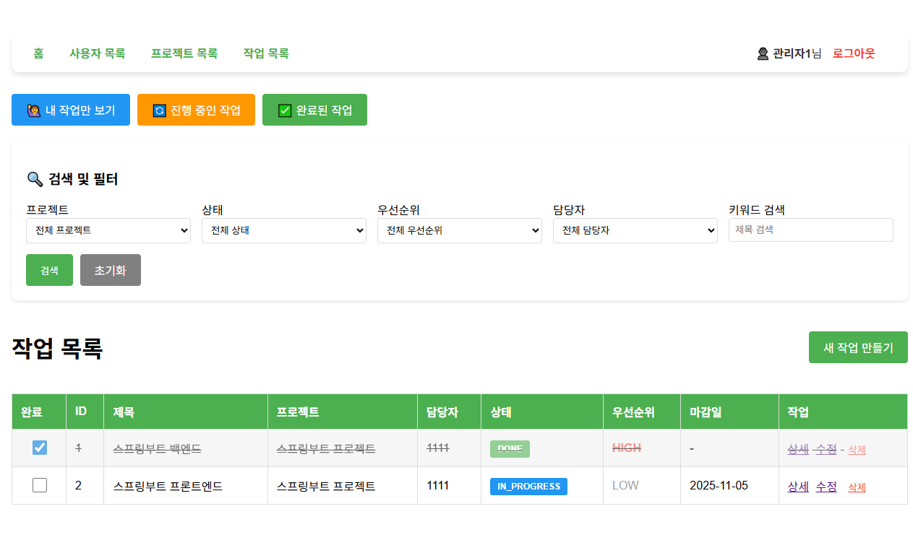

# 협업 TODO List 관리 시스템

## 프로젝트 소개
팀 프로젝트의 작업을 효율적으로 관리하기 위한 웹 기반 협업 도구

## 개발기간
- 2025년 10월 24일 ~ 10월 31일(약 1주)

## 개발 인원
- 1인 개발

## 주요 기능
1. 사용자 관리
 - 회원가입 및 로그인
 - 권한별 접근 제어 (ADMIN, MANAGER, VIEWER)
 - 사용자 목록 조회 및 관리
2. 프로젝트 관리
 - 프로젝트 생성, 수정, 삭제
 - 프로젝트별 작업 통계
 - 프로젝트별 완료율 추적
3. 작업 관리
 - 작업 생성, 수정, 삭제
 - 작업 상태 관리 (대기, 진행중, 완료)
 - 우선 순위 설정 (높음, 보통, 낮음)
 - 담당자 할당
 - 마감일 설정
 - 작업 검색 및 필터링
4. 댓글 기능
 - 작업별 댓글 작성, 수정, 삭제
 - 실시간 댓글 수 표시
5. 대시보드
 - 전체 통계 시각화 (사용자, 프로젝트, 작업 수)
 - 작업 상태별 차트
 - 완료율 프로그레스 바
 - 마감 임박 작업 알림(7일 이내)
 - 최근 작업 목록
6. 권한 관리
 - ADMIN: 모든 기능 사용 가능
 - MEMBER: 프로젝트 및 작업의 생성, 수정, 삭제 가능
 - VIEWER: 조회만 가능

## 기술 스택
Backend
 - Java 21
 - Spring Boot 3.5.7
 - Spring Data JPA
 - Hibernate

Frontend
 - Thymeleaf
 - HTML/CSS
 - JavaScript (Vanilla)

Database
 - MariaDB 10.5.15

Build Tool
 - Gradle

개발 도구
 - IntelliJ IDEA

## 시스템 아키텍처


계층별 역학
 - Presentation Layer: 사용자 요청 처리 및 응답 반환
 - Business Layer: 비즈니스 로직 처리
 - Data Access Layer: 데이터베이스 연동
 - Database: 데이터 영구 저장

## ERD
<br>


## 실행 방법
1. 사전 요구사항
 - JDK17 이상
 - MariaDB 10 이상
 - Gadle
2. 데이터베이스 설정
 ```sql
CREATE DATABASE todolist CHARACTER SET utf8mb4 COLLATE utf8mb4_unicode_ci;
```
3. application.yml 설정
```bash
# application-dev.yml.example을 복사
cp src/main/resources/application-dev.yml.example src/main/resources/application-dev.yml
```
```yaml
spring:
   application:
      name: List

   datasource:
      url: jdbc:mariadb://localhost:3307/todolist?characterEncoding=utf8&useSSL=false
      driver-class-name: org.mariadb.jdbc.Driver
      username: your_username # 본인의 DB 사용자명으로 변경
      password: your_password # 본인의 DB 비밀번호로 변경

   jpa:
      hibernate:
         ddl-auto: update
      show-sql: true
      properties:
         hibernate:
            format_sql: true
            dialect: org.hibernate.dialect.MariaDBDialect
```
4. 실행
```bash
./gradlew bootRun
```
5. 접속
```
http://localhost:8080
```
## 주요 화면
대시보드
 - 전체 통계 및 차트

 - 마감 임박 작업 알림

 - 최근 작업 목록


프로젝트 관리
 - 프로젝트 목록 (검색 및 필터링)

 - 프로젝트별 작업 통계


작업 통계
 - 작업 목록 (검색 및 필터링)

 - 작업 상세 (댓글 포함)

 - 작업 생성/수정
<br>


## 트러블슈팅
1. 작업 검색 기능 오류
 - 문제: 빈 문자열("")이 포함된 검색 파라미터로 인해 의도하지 않은 검색 결과 발생
 - 원인:
```java
   // 문제 코드
   if (status != null || priority != null || assigneeId != null || keyword != null)
```
 - 해결:
```java
   // 수정 코드
boolean hasSearchCondition =
        (status != null && !status.isEmpty()) ||
        (priority != null && !priority.isEmpty()) ||
        (assigneeId != null && !assigneeId.isEmpty()) ||
        (keyword != null && !keyword.isEmpty());
```
2. 로그인 후 리다이렉트 경로 문제
 - 문제: 로그인 성공 후 404 에러 발생
   (No static resource .
   org.springframework.web.servlet.resource.NoResourceFoundException)
 - 원인: WebConfig에서 "/" 루트 경로도 로그인 체크 대상에 포함되어 무한 리다이렉트 발생
 - 해결: "/" 경로를 인터셉터 제외 대상에 추가
```java
@Override
public void addInterceptors(InterceptorRegistry registry) {
        registry.addInterceptor(loginInterceptor)
        .addPathPatterns("/**")     // 모든 경로에 적용
        .excludePathPatterns(       // 제외할 경로
        "/",
        "/login",
        "/logout",
        "/users/signup",
        "/css/**",
        "/js/**",
        "/images/**"
        );
}
```
3. 작업 삭제 시 외래키 제약조건 오류
 - 문제: 작업 삭제 시 해당 작업의 댓글이 남아 있을 경우 외래키 제약조건 위반
 - 원인:  Task와 Comment가 외래키로 연결되어 있어 부모(Task) 삭제 시 자식(Comment)이 남아있음
 - 해결: cascade = CascadeType.ALL과 orphanRemoval = true 설정으로 작업 삭제 시 관련 댓글 자동 삭제
```java
@Entity
public class Task {
    @OneToMany(mappedBy = "task", cascade = CascadeType.ALL, orphanRemoval = true)
    private List<Comment> comments = new ArrayList<>();
}
```
4.  마감 임박 작업 조회 최적화
 - 문제: 모든 작업을 조회 후 필터링으로 인한 성능 저하
 - 해결 : 
```java
// TaskCreateRequest의 String dueDate를 LocalDate로 변환
return taskRepository.findAll().stream()
        .filter(task -> task.getDueDate() != null)
        .filter(task -> !task.getDueDate().isBefore(today))
        .filter(task -> !task.getDueDate().isAfter(deadline))
        .filter(task -> task.getStatus() != TaskStatus.DONE)
        .sorted(Comparator.comparing(Task::getDueDate))
        .collect(Collectors.toList());
```

## 개발자
 - 이름: 원종성
 - Email: wgs96@naver.com
 - GitHub: https://github.com/wgs0319/todo-list-project

## 라이센스
This project is licensed under the MIT License.